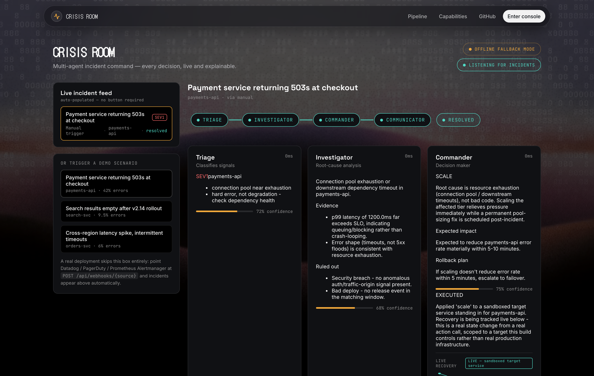

# Crisis Room

**Automated incident response — detect a failing service, diagnose the cause, apply the fix, and confirm recovery, with every step streamed live to a dashboard.**

Team **Gol_Gappe** — Riddhika Sachdeva & Hemank Aggarwal (MAIT, Delhi)
Build with Bharat 2.0 · National Level Hackathon · NIT Delhi (organized by CodeVerse)



---

## What it does

When a production service breaks, one on-call engineer has to do four jobs at once under a clock: work out how bad it is, find the cause, choose a fix, and keep everyone informed. Crisis Room runs that whole loop on its own.

You tell it which services to watch. From then on it opens an incident the moment one genuinely degrades, works it end to end through four specialized agents, executes the chosen remediation, measures the real recovery, and delivers the resolution report — while a live dashboard renders each agent's output as it's produced.

This repo is a working implementation, verified end to end — not a mockup.

---

## How it works

```
Monitoring tool  ──webhook──┐
Built-in synthetic monitor ─┤
                            ▼
              Incident signal  (one shared typed format)
                            │
                            ▼
   Triage ─▶ Investigator ─▶ Commander ─▶ Communicator
                            │
                            ▼
            Execution layer ─▶ target service / real infra
                            │
                            ▼
   Persisted timeline  +  live dashboard stream  +  notifications
```

| Agent | Job | Takes in | Produces |
|---|---|---|---|
| **Triage** | Classify severity, flag what to look at | The raw alert / monitoring signal | Severity (`SEV1`–`SEV4`), affected services, leads |
| **Investigator** | Find the most likely root cause | Triage output + signal detail | A specific hypothesis, its evidence, and the causes ruled out and why |
| **Commander** | Choose one remediation and justify it | Triage + Investigator output | One action (`rollback` / `restart` / `scale` / `failover` / `escalate` / `monitor`) with rationale, expected impact, rollback plan |
| **Communicator** | Draft stakeholder updates | Current incident state | Three messages — customer status page, engineering, leadership — plus a next-update time |

Every agent's output is validated against one shared schema (`agents/models.py`) before it can reach the next agent or the dashboard. That single typed contract is what keeps a multi-stage pipeline predictable. The classification and decision logic also runs fully offline against a library of incident signatures and thresholds, so a weak network can't break a demo and the pipeline doesn't depend on any external service being reachable.

The Communicator fires twice — an early "we're on it" notice right after Triage so no audience sits in silence, and the resolution update at the end.

---

## Detection — two ways in

**Built-in synthetic monitoring.** Register a service URL. Crisis Room polls it on an interval, keeps a rolling window of the actual status codes and response times it observed, and opens an incident only on sustained, genuine degradation — a run of failures, a sustained error rate, or a breached latency ceiling — never on a single slow response. It re-arms when the service recovers, and treats a change in the failure's character mid-incident as a new problem.

**Webhook ingestion.** Point an existing monitoring tool at one endpoint:

```
POST /api/webhooks/{datadog|pagerduty|prometheus|generic}
```

`integrations/adapters.py` normalizes each tool's payload into the shared incident format and the full pipeline runs with no human involvement. A tool that isn't covered yet works through `generic`, or gets support by adding one adapter function — nothing else in the pipeline changes.

**One always-on connection.** `GET /ws/live` is a single stream a dashboard keeps open; any incident, from any source, appears on it automatically and updates until it resolves.

---

## Real execution, honest outcomes

Crisis Room doesn't stop at a recommendation. The Commander's action is handed to an execution layer that carries it out, and the target's recovery is then **measured**, tick by tick, over real time.

The build ships with a target service (`integrations/target_service.py`) that has real, injectable faults and a real control interface. When the Commander picks the right action, that service genuinely stops failing and recovers on the next polls. When it picks the wrong one, it genuinely doesn't — the recovery curve stays flat at the real error rate.

Every incident ends in one of three honest states:

| State | Meaning |
|---|---|
| **resolved** | Remediation applied, service measured healthy again |
| **mitigation failed** | Remediation applied but the service is still degraded — flagged for a person |
| **awaiting execution** | Diagnosed and decided, but no control channel to carry the fix out |

The execution layer is one interface. Pointing it at a real Kubernetes cluster, cloud API, or deploy pipeline is a single new implementation — the agents, orchestrator, and dashboard don't change. A recommend-only mode (`CRISIS_ROOM_EXECUTOR=noop`) logs the decision and touches nothing.

---

## Two surfaces

**The live console** (`/console`) — open, no login, always listening. An incident feed that populates itself, and for each incident a pipeline rail, a panel per agent, a running decision log, and a live recovery chart. Three scripted scenarios give a repeatable walkthrough that reaches a different correct decision each time from different evidence.

**The accounts area** (`/app`) — sign in with an email and password, register the services you want watched and their thresholds, browse your incident history, replay any incident's full timeline stage by stage, and configure where resolution reports are delivered (email, and optionally a Slack channel).

---

## Repo layout

```
crisis-room/
├── agents/            Triage, Investigator, Commander, Communicator + the shared Pydantic contract
├── orchestrator/      Chains the agents, yields each result the instant it's produced
├── integrations/
│   ├── adapters.py         Datadog / PagerDuty / Prometheus / generic webhook normalizers
│   ├── synthetic_monitor.py  Polls a URL, rolling window, decides when a real incident exists
│   ├── executor.py           Execution layer — applies the action, streams measured recovery
│   ├── target_service.py     A controlled service with injectable faults + a control interface
│   └── mock_infra.py         Sandboxed recovery target
├── monitoring/        Background task per watched service; runs + persists the pipeline
├── api/               Authenticated REST — accounts, sites, incidents, account settings
├── auth/              Email + password, signed-cookie sessions
├── db/                SQLAlchemy models + engine (SQLite)
├── persistence/       Incident + event read/write helpers
├── server/main.py     FastAPI REST + WebSocket layer, webhook ingestion, live feed
├── fixtures/          The 3 scripted demo scenarios
├── config.py          Environment-driven settings
├── docs/              Project brief (HTML + PDF), screenshots
├── frontend/          Next.js dashboard (App Router)
│   ├── app/                pages, layout, design tokens (globals.css)
│   ├── components/         PipelineRail, AgentPanel, ReasoningTerminal, RecoveryChart, …
│   └── lib/                REST + WebSocket clients
├── Dockerfile         Backend container
└── requirements.txt
```

---

## Running locally

### Backend

```bash
pip install -r requirements.txt

cp .env.example .env
# set SESSION_SECRET (any long random string); the rest have working defaults
#   python -c "import secrets; print(secrets.token_urlsafe(64))"

uvicorn server.main:app --reload --port 8000
```

Check it: `curl http://localhost:8000/api/health`

The `/console` demo needs nothing configured. The authenticated area needs `SESSION_SECRET`; email notifications need a `RESEND_API_KEY` (see `.env.example`).

### Frontend

```bash
cd frontend
npm install
npm run dev
```

Open **http://localhost:3000** for the landing page, **/console** for the live demo dashboard, or **/signup** to create an account. If the backend isn't on `localhost:8000`, set `NEXT_PUBLIC_API_BASE` before `npm run dev`.

### Docker (backend)

```bash
docker build -t crisis-room-api .
docker run -p 8000:8000 -e SESSION_SECRET=$(python -c "import secrets;print(secrets.token_urlsafe(64))") crisis-room-api
```

---

## Demo scenarios

Scripted fixtures so a walkthrough tells the same verifiable story every run:

| Scenario | Story | Correct diagnosis | Correct action |
|---|---|---|---|
| `payment-outage` | 42% error rate, DB pool near max, no recent deploy | connection pool exhaustion | **SCALE** |
| `bad-deploy` | Errors start right after a schema-migration deploy | deploy / migration regression | **ROLLBACK** |
| `network-partition` | Cross-region timeouts, packet loss on the link | cross-region network degradation | **FAILOVER** |

```bash
curl -X POST http://localhost:8000/api/incidents/scenario/payment-outage
# -> {"incident_id": "INC-XXXXXXXX"}
```

---

## Tech stack

**Backend** — Python · FastAPI · Uvicorn · SQLAlchemy 2 · SQLite · Pydantic 2 / pydantic-settings · httpx · PyJWT · passlib + bcrypt · Resend (email)

**Frontend** — Next.js 14 (App Router) · React 18 · CSS variables + styled-jsx · lucide

**Interfaces** — REST + WebSocket streaming · webhook ingestion with per-source adapters · async background monitoring tasks · one typed schema across every pipeline stage

**Tooling** — Docker · Playwright (headless visual QA)

---

## License

GNU General Public License v3.0 — see [LICENSE](LICENSE).
Copyright (C) 2026 Riddhika Sachdeva, Hemank Aggarwal.
